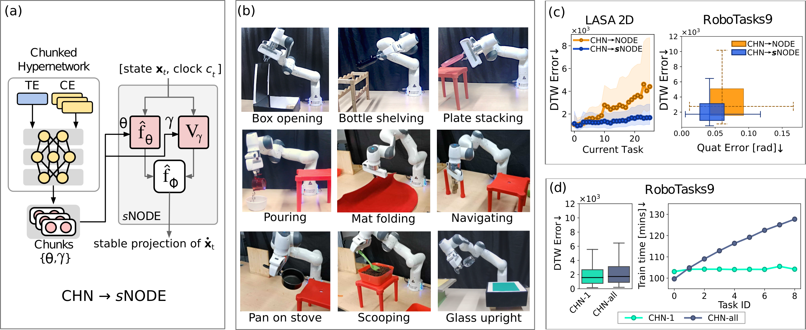

# Stable Continual Learning from Demonstration
This repository contains the code and datasets for our paper **Scalable and Efficient Continual Learning from Demonstration via a Hypernetwork-generated Stable Dynamics Model** ([preprint](https://arxiv.org/abs/2311.03600)).

## Overview
We propose a novel hypernetwork-based approach for stable continual learning from demonstration, enabling a robot to sequentially acquire multiple trajectory-based stable motion skills with a single hypernetwork without retraining on previous demonstrations. The stability in learned trajectories not only prevents divergence in motion but also greatly enhances continual learning performance, particularly in our most size-efficient model. We propose an efficient hypernetwork training method and provide new datasets for the LfD community. Evaluations on various benchmarks, including real-world robotic manipulation tasks, validate our approach.

<p style="text-align:center">
   
  <figcaption>Fig 1. Overview of our approach and key results. Refer to our preprint for details.</figcaption>
</p>

<p style="text-align:center">
   
  <figcaption>Fig 2. After continually learning the 9 real-world tasks of the RoboTasks9 dataset with a single CHN-sNODE model, the robot is able to perform any of the past tasks accurately (each task involves changing positions and orientations).</figcaption>
</p>

A video showing collection of demonstrations and empirical evaluations with a physical robot (also available on [Youtube](https://www.youtube.com/watch?v=2zB2gvvCePU)):

https://github.com/sayantanauddy/clfd-snode/assets/10401716/b634a1b8-bd16-4340-a04f-62e5343d7890


## Datasets

### High-dimensional LASA
The LASA 2D, 8D, 16D and 32D datasets used in our experiments can be found in `datasets/LASA` in the form of `.npy` files.

### RoboTasks9
The RoboTasks9 dataset can be found in `datasets/robottasks/pos_ori`.

## Installation

```bash
# Clone this repository and move inside it
git clone https://github.com/sayantanauddy/clfd-snode.git
cd clfd-snode

# Create a virtual environment
python3.8 -m venv <path/to/venv>

# Activate virtual environment
source <path/to/venv>/bin/activate

# Install requirements
# If GPU is available, change torch==1.8.1+cpu to torch==1.8.1 in requirements.txt
python -m pip install -r requirements.txt

```

## Model Training

Below we show how to the training scripts can be invoked for HN$\rightarrow$sNODE and CHN$\rightarrow$sNODE using the LASA 2D dataset.

```bash
# Activate virtual environment
source <path/to/venv>/bin/activate

# Train HN->sNODE on LASA 2D
python tr_hn_lsddm.py --data_dir datasets/LASA/lasa_numpy --num_iter 15000 --tsub 20 --lr 0.0001 --tnet_dim 2 --fhat_layers 3 --explicit_time 1 --hnet_arch 200,200,200 --task_emb_dim 256 --beta 0.005 --tangent_vec_scale 1.0 --lsddm_hp 100 --lsddm_h 100 --data_class LASA --eval_during_train 0 --seed 100 --seq_file datasets/LASA/lasa_numpy_sequence_all.txt --log_dir logs --description tr_hn_snode_LASA2D, --plot_traj 0 --plot_vectorfield 0

# Train CHN->sNODE on LASA 2D
python tr_chn_lsddm.py --data_dir datasets/LASA/lasa_numpy --num_iter 15000 --tsub 20 --lr 0.0001 --tnet_dim 2 --fhat_layers 3 --tnet_act elu --hnet_arch 200,200,200 --task_emb_dim 256 --chunk_emb_dim 256 --chunk_dim 8192 --explicit_time 1 --beta 0.005 --tangent_vec_scale 1.0 --lsddm_hp 100 --lsddm_h 1000 --data_class LASA --seed 100 --seq_file datasets/LASA/lasa_numpy_sequence_all.txt --log_dir logs --description tr_chn_snode_LASA2D --plot_traj 0 --plot_vectorfield 0
```

The above scripts can be used for the other datasets in our paper by changing the value of the arguments `data_dir` and `seq_file` as shown below. Additionally, other hyperparameters should be adjusted as specified in the [appendix of our paper](https://arxiv.org/pdf/2311.03600.pdf#page=23).

| Dataset    |  `data_dir`                  |  `seq_file`                                                  |
|------------|------------------------------|--------------------------------------------------------------|
| LASA 2D    | datasets/LASA/lasa_numpy     | datasets/LASA/lasa_numpy_sequence_all.txt                    |
| LASA 8D    | datasets/LASA/lasa_numpy_8D  | datasets/LASA/lasa_numpy_8D_sequence_all.txt                 |
| LASA 16D   | datasets/LASA/lasa_numpy_16D | datasets/LASA/lasa_numpy_16D/lasa_numpy_16D_sequence_all.txt |
| LASA 32D   | datasets/LASA/lasa_numpy_32D | datasets/LASA/lasa_numpy_32D/lasa_numpy_32D_sequence_all.txt |
| RoboTasks9 | datasets/robottasks/pos_ori  | datasets/robottasks/robottasks_pos_ori_sequence_all.txt      |

## Acknowledgements

We gratefully acknowlege these openly accessible repositories which were a great help in writing the code for our experiments:

1. [Continual Learning with Hypernetworks](https://github.com/chrhenning/hypercl)
2. [Learning Stable Deep Dynamics Models](https://github.com/locuslab/stable_dynamics)
3. [Notebook](https://colab.research.google.com/drive/1ygdXFuih_0sLA2HosQkaVQOA9v6BMSdj?usp=sharing) containing starter code for Neural ODEs by Çağatay Yıldız
4. [Fast implementations of the Frechet distance](https://github.com/joaofig/discrete-frechet)

## Citation

If you use our code, datasets or our results in your research, please cite:

```
@misc{auddy2024scalable,
      title={Scalable and Efficient Continual Learning from Demonstration via a Hypernetwork-generated Stable Dynamics Model}, 
      author={Sayantan Auddy and Jakob Hollenstein and Matteo Saveriano and Antonio Rodríguez-Sánchez and Justus Piater},
      year={2024},
      eprint={2311.03600},
      archivePrefix={arXiv},
      primaryClass={cs.RO}
}
```
